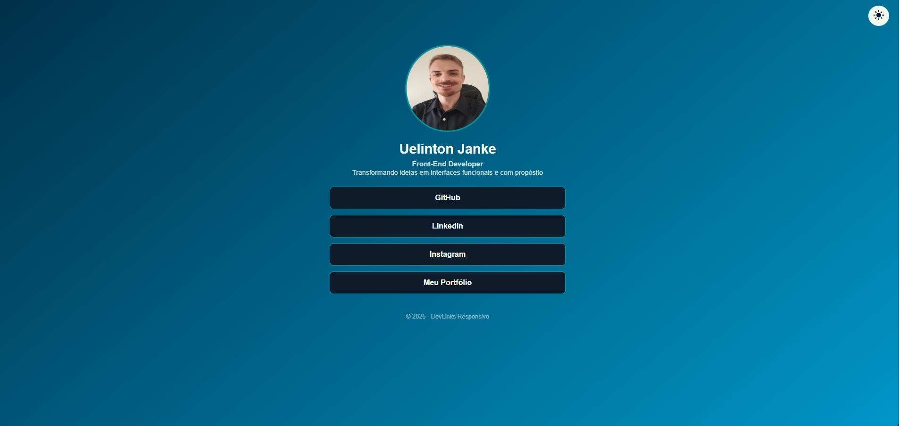

# 🔗 [DevLinks Responsivo - Mobile First](https://devlinks-responsivo.vercel.app/)

Mini projeto inspirado no Linktree, criado com foco em **interfaces limpas, mobile-first** e alternância de **tema claro/escuro**. Desenvolvido como exercício de **UX, acessibilidade e código previsível**, usando apenas HTML, CSS e JavaScript puro.

---

## 📘 Micro-história — Refatoração DevLinks

### Situação:
O DevLinks foi um dos meus primeiros projetos focados em interface limpa, mobile-first e alternância de tema. Ele já funcionava bem, centralizando links de forma simples e visualmente agradável.

### Incômodo:
Com o tempo, percebi que algumas decisões poderiam gerar problemas de manutenção e UX no longo prazo: seletores frágeis no CSS, estado de tema implícito no JS e falta de persistência da preferência do usuário. Além disso, a estrutura HTML poderia ser mais semântica e previsível.

### Ação:
Refatorei incrementalmente:

* Tornei o estado do tema explícito e persistente usando localStorage.
* Melhorei a semântica do HTML (&#139;h2&#155; para subtítulo, &#139;p class="bio"&#155; para descrição).
* Evitei seletores frágeis no CSS, organizando tokens de design (--color-bg, --color-accent).
* Adicionei pequenos feedbacks visuais (hover e active) no botão de alternar tema.

### Aprendizado:
Código que funciona não é suficiente. Clareza, previsibilidade e pequenas melhorias de UX acumulam valor, facilitam manutenção e tornam o produto mais agradável para o usuário e para quem mantém o código.

---

## 🚀 Funcionalildades

- Layout **100% mobile-first**
- Gradiente e efeitos de hover nos links
- **Tema claro/escuro** com persistência de preferência 
- Componentes reutilizáveis
- Hierarquia clara de conteúdo: nome, subtítulo e bio
- Feedback de interação no botão de tema (hover e active)

---

## 🛠️ Tecnologias Utilizadas

- HTML5 semântico
- CSS3 (variáveis, transições, responsividade)
- JavaScript (estado previsível e persistente)
- Git & GitHub

---

## 📸 Preview 



---

## 📦 Como executar o projeto

```
git clone https://github.com/UelintonHJ/devlinks-responsivo.git
cd devlinks-responsivo
abrir o index.html no navegador
```
Ou acesse diretamente:
[https://devlinks-responsivo.vercel.app/](https://devlinks-responsivo.vercel.app/)

---

## 📚 Aprendizados e Insights de Produto

* Separar intenção de variáveis CSS ajuda na previsibilidade e evolução futura do projeto.
* HTML semântico melhora acessibilidade e clareza do código.
* JavaScript previsível e persistente garante melhor UX.
* Pequenos feedbacks de UI/UX aumentam a sensação de produto "vivo".
* Hierarquia clara de conteúdo reforça comunicação e marca pessoal.

---

## 🧑‍💻 Autor

**Uelinton Janke** <br/>

LinkedIn: [https://www.linkedin.com/in/uelinton-janke/](https://www.linkedin.com/in/uelinton-janke/)
